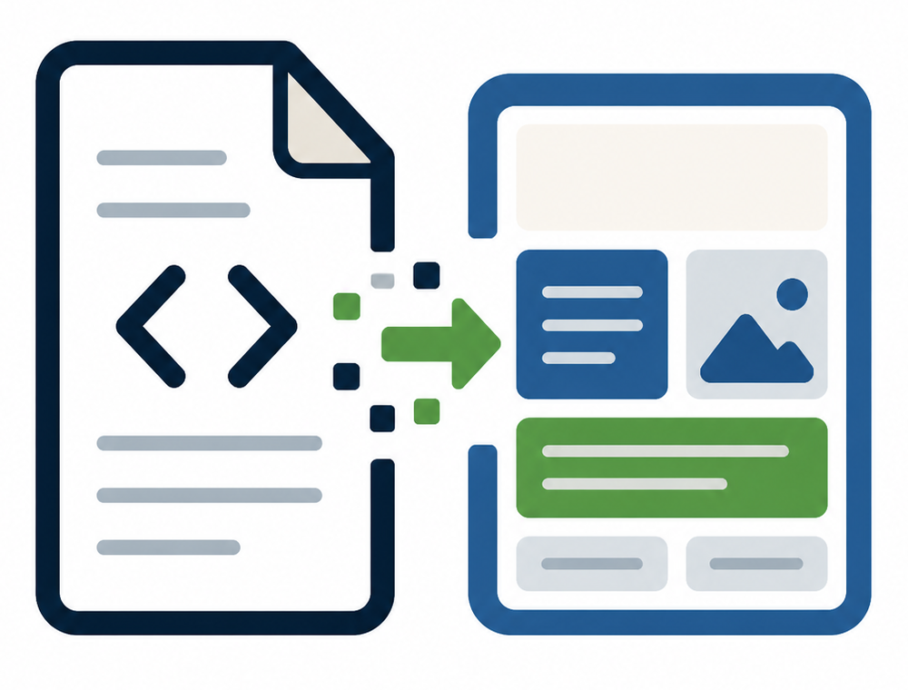

<p align="center">
  
</p>

<p align="center">
  <a href="https://www.npmjs.com/package/docspress"></a>
  <a href="LICENSE"></a>
</p>

<p align="center">
  <strong>Markdown in GitHub. WordPress as the publishing surface.</strong><br>
  Sync Markdown documentation into WordPress Pages as Gutenberg-compatible block content.
</p>

## Install with an AI coding agent

DocsPress includes two repository-aware skills. Choose the path that matches the target project:

- **The repository already has Markdown documentation:** use [`docspress-install`](.claude/skills/docspress-install/SKILL.md) to inspect the existing docs, configure the GitHub Action and WordPress authentication, and verify a safe draft dry run.
- **The repository does not have usable documentation:** use [`generate-docs-from-source`](.claude/skills/generate-docs-from-source/SKILL.md) to derive a verified `docs/` tree with the appropriate DocsPress Gutenberg blocks from source code, tests, examples, and configuration, then hand off to the installer skill.

Install both skills into the target repository with the Skills CLI:

```bash
npx skills add Automattic/docspress --all --full-depth
```

Then give the coding agent one of these instructions:

```text
Use $docspress-install to publish this repository's existing documentation to WordPress. Start with a draft dry run and do not expose credentials.
```

```text
Use $generate-docs-from-source to inspect this repository, generate and verify DocsPress-compatible documentation with the appropriate Gutenberg blocks from the source code, and configure the GitHub Action if it is missing.
```

Docspress keeps Markdown and WordPress documentation synchronized. It can publish merged Markdown as managed Gutenberg Pages, turn WordPress editor changes into a GitHub pull request, or safely reconcile both directions.

## Why Docspress?

- Keep docs in Markdown next to the code they describe.
- Publish to WordPress Pages instead of moving docs to a separate docs CMS.
- Preserve nested docs folders as parent and child WordPress Pages.
- Convert Markdown into Gutenberg core blocks instead of one large HTML blob.
- Protect manual WordPress content with managed-page sentinels.
- Review planned changes with `dry-run` before writing to WordPress.
- Support manifests, redirects, rewritten local links, and edit links.
- Propose WordPress editor changes as readable Markdown pull requests.

## Project status

Docspress is early software. The core sync loop works, and the first-class target is WordPress.com with OAuth bearer tokens. Custom WordPress REST API base URLs are available through `wordpress-url`, but WordPress.com is the best-tested path right now.

## Repository layout

- `src/`, `bin/`, and `scripts/` contain the GitHub Action, npm package, and Playground docs generator.
- [`docs/`](docs/) contains the source-backed DocsPress product documentation published by the Action and previewed in Playground.
- [`theme/`](theme/) contains the installable DocsPress WordPress theme and its local Playground blueprint.
- [`plugins/docspress-blocks/`](plugins/docspress-blocks/) provides documentation-focused Gutenberg blocks and starter patterns.

The WordPress theme and plugin directories are distributed through this GitHub repository. They are intentionally excluded from the `docspress` npm tarball, which remains focused on the Action and CLI runtime.

Run the complete WordPress experience from the repository root:

```bash
npx @wp-playground/cli@latest start \
  --path=theme \
  --mount="$(pwd)/plugins/docspress-blocks:/wordpress/wp-content/plugins/docspress-blocks" \
  --blueprint=theme/blueprint.json \
  --port=9400
```

## Quick start

Create a workflow in the repository that owns your Markdown docs:

```yaml
name: Sync docs to WordPress

on:
  push:
    branches: [main]
    paths:
      - "docs/**/*.md"
      - "docs/**/*.markdown"
      - "docs/**/*.json"
      - ".github/workflows/sync-docs.yml"
  workflow_dispatch:

jobs:
  sync:
    runs-on: ubuntu-latest
    steps:
      - uses: actions/checkout@v4
      - uses: Automattic/docspress@main
        with:
          wordpress-site: fkadev.blog
          wordpress-access-token: ${{ secrets.WP_ACCESS_TOKEN }}
          docs-dir: docs
          root-slug: docs
          root-title: Docs
          status: draft
          dry-run: true
```

Start with `dry-run: true`. When the plan looks right in the GitHub Actions summary, switch to `dry-run: false`.

## Two-way synchronization

Use `mode: reconcile` after the publish workflow is proven. Push events publish GitHub-only changes; the five-minute schedule detects WordPress-only edits and maintains one rolling pull request.

```yaml
name: Reconcile docs

on:
  push:
    branches: [main]
    paths: ["docs/**", ".github/workflows/sync-docs.yml"]
  schedule:
    - cron: "3/5 * * * *"
  workflow_dispatch:

permissions:
  contents: write
  pull-requests: write

concurrency:
  group: docspress-sync
  cancel-in-progress: false

jobs:
  sync:
    # Do not publish a merged WordPress-to-GitHub proposal back to WordPress.
    if: >-
      github.event_name != 'push' ||
      !contains(
        github.event.head_commit.message,
        format('from {0}/docspress/wordpress-sync', github.repository_owner)
      )
    runs-on: ubuntu-latest
    steps:
      - uses: actions/checkout@v4
      - uses: Automattic/docspress@main
        with:
          mode: reconcile
          wordpress-site: fkadev.blog
          wordpress-access-token: ${{ secrets.WP_ACCESS_TOKEN }}
          docs-dir: docs
          root-slug: docs
          status: publish
```

`publish` remains the default. `propose` only prepares WordPress changes and refreshes synchronization metadata; `reconcile` also publishes non-conflicting GitHub changes. If the same Page changes on both sides, the run reports a conflict before writing either side.

Reverse synchronization compares Gutenberg blocks semantically and changes only the matching Markdown source regions. WordPress editor metadata and omitted default attributes do not create diff noise; unchanged frontmatter, code fences, tables, and custom-block comments remain untouched. When a block cannot be represented safely as readable Markdown, DocsPress preserves its serialized Gutenberg form.

`reconcile` leaves each WordPress-only Page unchanged while its pull request is open. Once the pull request merges, the next run refreshes the synchronization sentinel; GitHub-only changes to other Pages still publish normally.

The job condition skips the `push` event created when GitHub merges DocsPress's action-owned `docspress/wordpress-sync` branch. Scheduled and manual runs still reconcile normally. If you customize `pull-request-branch`, update the branch name in this condition too. As a fallback for workflows without the condition, the Action recognizes its configured branch in GitHub's merge commit and exits successfully without reading or writing WordPress.

The WordPress token reads and updates Pages. Pull requests use the job's `GITHUB_TOKEN`; no second stored secret is needed when the repository allows GitHub Actions to create pull requests.

## WordPress.com authentication

WordPress.com API writes require an OAuth bearer token with the `global` scope. Docspress includes a token helper so you can authorize in the browser and store the result as a GitHub Actions secret.

1. Create an app at [WordPress.com Apps](https://developer.wordpress.com/apps/).
2. Set the redirect URL to `http://localhost:8787/callback`.
3. Run the helper:

```bash
npx docspress token \
  --client-id YOUR_CLIENT_ID \
  --client-secret YOUR_CLIENT_SECRET \
  --site fkadev.blog \
  --repo OWNER/REPO
```

The helper opens WordPress.com, waits for the local callback, exchanges the authorization code for an access token, and prints a `gh secret set` command.

To store the secret directly, install and authenticate the GitHub CLI, then run:

```bash
npx docspress token \
  --client-id YOUR_CLIENT_ID \
  --client-secret YOUR_CLIENT_SECRET \
  --site fkadev.blog \
  --repo OWNER/REPO \
  --set-secret
```

The secret name is `WP_ACCESS_TOKEN`. Use it in your workflow as `${{ secrets.WP_ACCESS_TOKEN }}`.

## Configuration

| Input | Default | Description |
| --- | --- | --- |
| `mode` | `publish` | `publish`, `propose`, or `reconcile`. |
| `wordpress-url` | `https://public-api.wordpress.com` | WordPress API base URL. |
| `wordpress-site` | required | WordPress.com site ID or domain, such as `fkadev.blog`. |
| `wordpress-access-token` | required | OAuth bearer token that can edit pages. |
| `docs-dir` | `docs` | Markdown docs directory. |
| `manifest-file` | empty | Optional JSON manifest that defines page slugs, parents, titles, and Markdown source files. |
| `redirects-file` | empty | Optional JSON map of old docs paths to new docs paths or external URLs. Creates managed moved-page placeholders. |
| `root-slug` | `docs` | Managed root page slug. |
| `root-title` | `Docs` | Managed root page title when no root `index.md` exists. |
| `create-h1` | `false` | Add the page title as an H1 block at the top of generated content. |
| `rewrite-links` | `true` | Rewrite local Markdown links to generated WordPress page URLs. |
| `edit-link` | `false` | Append an "Edit this page on GitHub" link to Markdown-backed pages. |
| `edit-link-text` | `Edit this page on GitHub` | Link text used when `edit-link` is enabled. |
| `github-repository` | `GITHUB_REPOSITORY` | Repository used for edit links, such as `owner/repo`. |
| `github-ref` | `GITHUB_REF_NAME` | Branch or ref used for edit links. |
| `github-server-url` | `GITHUB_SERVER_URL` | GitHub server URL used for edit links. |
| `github-token` | `github.token` | Token used for reverse-sync branches and pull requests. |
| `pull-request-base` | repository default branch | Base for reverse-sync pull requests. |
| `pull-request-branch` | `docspress/wordpress-sync` | Dedicated rolling proposal branch. |
| `pull-request-title` | generated | Optional pull request and commit title override. By default DocsPress creates a Conventional Commits title such as `docs(sync-and-rest-api): sync changes from WordPress`. |
| `status` | `publish` | Status for created or updated pages. Use `draft` for private review or `publish` for public pages. |
| `delete-mode` | `trash` | Use `trash` or `force` for removed Markdown files. |
| `dry-run` | `false` | Plan changes without writing to WordPress or GitHub. |

Docspress writes these outputs:

| Output | Description |
| --- | --- |
| `created` | Count of pages created or planned for creation. |
| `updated` | Count of pages updated or planned for update. |
| `deleted` | Count of pages deleted or planned for deletion. |
| `unchanged` | Count of managed pages already in sync. |
| `conflicts` | Count of unmanaged or two-sided synchronization conflicts. |
| `proposed` | Count of repository files proposed from WordPress. |
| `skipped` | Whether the Action skipped a managed reverse-sync merge push. |
| `pull-request-number` | Rolling reverse-sync pull request number. |
| `pull-request-url` | Rolling reverse-sync pull request URL. |
| `summary-json` | JSON summary of the sync result. |

## Docs mapping

Without a manifest, Docspress discovers every `.md` and `.markdown` file under `docs-dir`:

```text
docs/index.md                    -> /docs/
docs/getting-started.md          -> /docs/getting-started/
docs/guides/index.md             -> /docs/guides/
docs/guides/markdown-features.md -> /docs/guides/markdown-features/
```

Missing parent sections are created as managed placeholder pages. The page title comes from frontmatter `title`, then the first H1, then the filename. When the first H1 is used as the title, Docspress removes it from the body to avoid duplicate headings.

Set `create-h1: true` if you want Docspress to add the WordPress page title as the first H1 block in the generated content. When the Markdown already starts with the same H1, Docspress reuses that title and avoids creating a duplicate.

## Markdown and Gutenberg support

Docspress maps common Markdown to Gutenberg-compatible core blocks:

| Markdown | WordPress output |
| --- | --- |
| Paragraphs and inline formatting | `core/paragraph` |
| Headings | `core/heading` |
| Ordered, unordered, nested, and task lists | `core/list` |
| Blockquotes | `core/quote` |
| Fenced code blocks | `core/code` |
| GFM tables | `core/table` |
| Images | `core/image` |
| Horizontal rules | `core/separator` |
| Raw HTML | `core/html` |
| Serialized Gutenberg block comments | Preserved, with WordPress-safe attribute escaping |

Serialized Gutenberg block comments are an escape hatch for blocks Docspress does not map yet:

```html
<!-- wp:quote -->
<blockquote class="wp-block-quote"><p>Written as a raw Gutenberg block.</p></blockquote>
<!-- /wp:quote -->
```

Docspress preserves these annotations instead of wrapping them in an HTML block. WordPress is still responsible for validating the serialized block markup.

Docspress also supports Gutenberg Handbook-style code tabs:

````md


```jsx
<Button variant="primary" />
```

```js
wp.element.createElement(Button);
```

````

These become a Gutenberg HTML block containing `code-tabs`, `code-tab`, and `code-tab-block` markup.

## Manifest mode

Use `manifest-file` when you want stable slugs, titles, and parent relationships that are not purely derived from filenames.

```json
{
  "pages": [
    { "id": "root", "title": "Docs", "slug": "", "markdown_source": "index.md" },
    { "id": "guides", "title": "Guides", "slug": "guides" },
    {
      "id": "getting-started",
      "title": "Getting Started",
      "slug": "getting-started",
      "parent": "guides",
      "markdown_source": "guides/getting-started.md"
    }
  ]
}
```

`markdown_source` paths are resolved relative to the manifest file. Entries without `markdown_source` become managed placeholder pages.

## Redirect map

Use `redirects-file` to keep old docs paths alive after renames. On WordPress.com this creates a managed moved-page placeholder with a link to the new destination; it is not a server-level 301 redirect.

```json
{
  "redirects": {
    "old-getting-started": "guides/getting-started",
    "legacy/api": "https://developer.wordpress.org/rest-api/"
  }
}
```

Relative destinations are resolved under `root-slug`; absolute URLs are used as-is.

## Link rewriting

By default, local Markdown links are rewritten to generated WordPress page URLs:

```md
[Getting Started](guides/getting-started.md)
[Action Inputs](/docs/reference/action-inputs.md)
```

With `root-slug: docs`, those become:

```html
<a href="/docs/guides/getting-started/">Getting Started</a>
<a href="/docs/reference/action-inputs/">Action Inputs</a>
```

External links, anchors, `mailto:` links, and unknown local files are left unchanged. Set `rewrite-links: false` to preserve Markdown links exactly as written.

## Edit links

Set `edit-link: true` to append a source link to every Markdown-backed page:

```yaml
edit-link: true
edit-link-text: Improve this page on GitHub
github-repository: f/docspress-demo
github-ref: main
```

Generated placeholder and redirect pages do not get edit links.

## Safety model

Docspress adds a hidden sentinel comment to every page it manages. During sync it only updates or deletes WordPress pages that contain that sentinel. In `reconcile` mode the sentinel is also the common ancestor used to distinguish a one-sided edit from a true two-sided conflict.

Recommended first run:

```yaml
status: draft
dry-run: true
delete-mode: trash
```

Then review the GitHub Actions summary, change `dry-run` to `false`, and keep `status: draft` until the generated pages look right in WordPress.

## Development

```bash
npm install
npm test
npm run lint
npm run build
```

`dist/index.js` is committed so GitHub Actions can run the action without installing dependencies.

Before opening a pull request, run:

```bash
npm run package
```

That command lints, tests, and rebuilds the bundled action.

## Contributing

Contributions are welcome. Good first areas include Markdown-to-Gutenberg coverage, WordPress REST compatibility, docs examples, and tests for edge cases in sync behavior.

When proposing a change, please include:

- A short description of the docs workflow or WordPress behavior involved.
- Tests for parser, mapping, or sync changes when possible.
- Updated README examples when the public API changes.
- A rebuilt `dist/index.js` when source changes affect the GitHub Action bundle.

## License

Docspress is free software licensed under the GNU General Public License v3.0 or later. See [LICENSE](LICENSE).
